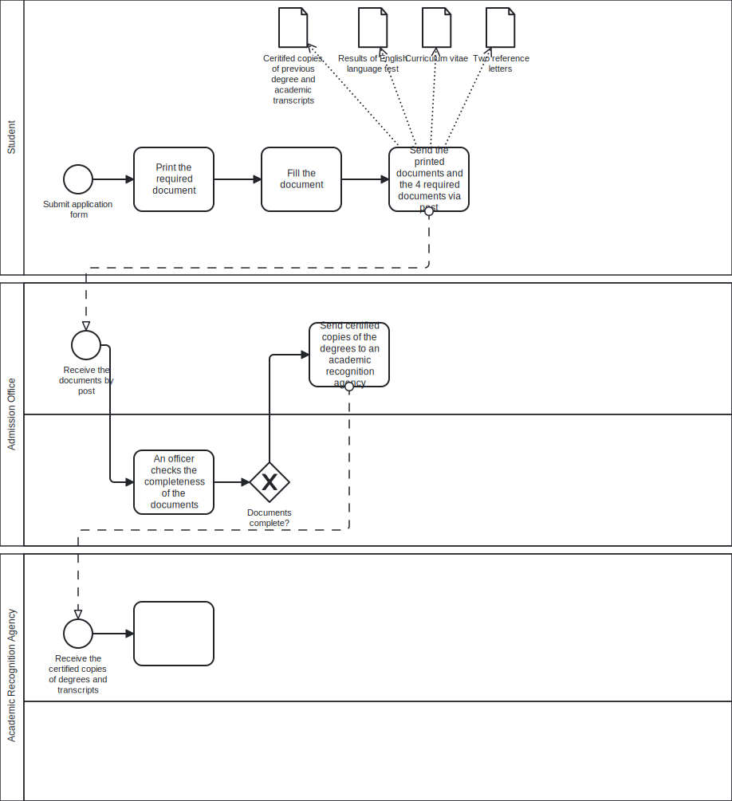

# Exercise 1.3
Consider the student admission process described in [[Solution 1.1|Exercise 1.1]] (page 5).
Taking the perspective of the customer, identify at least two performance
measures that can be attached to this process.

# Solution 1.3
One measure that can be attached to the student admission process mentioned, is
the time elapsed between the time the office receives the student documents and
the time the admission office sends the student an email to send the missing
document by post in case of documents incompleteness. This measure will reflect
the speed at which the office processes coming requests. 

